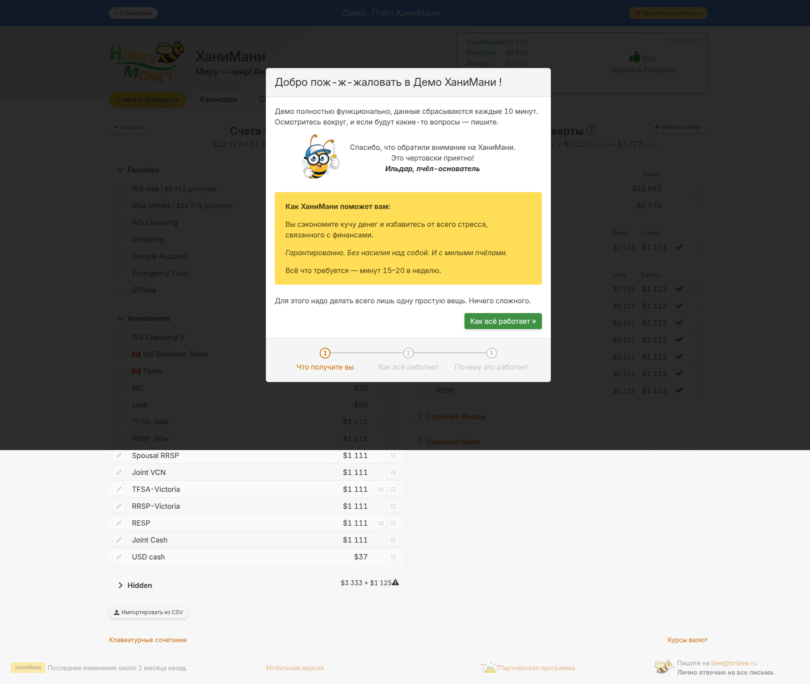

# ХаниМани — Конверты: интерфейс демо-кабинета

Скриншот страницы конвертов из демо-кабинета hmbee.ru (раздел «Счета»).

## Наблюдения

- Системные конверты (ХаниМани, Резервы) — отдельная безымянная секция таблицей; нет кнопки удаления, нет кнопки редактирования. Только просмотр баланса.
- Фонды — отдельная секция с колонками: иконка | название | сумма фонда | баланс | прогресс | кнопка ред.
- Цели — аналогично Фондам (иконка | название | целевая сумма | баланс | прогресс | кнопка ред.).
- Скрытые Фонды / Скрытые Цели — сворачиваемые секции (в демо пусты).
- Кнопки создания («+ Добавить фонд», «+ Добавить цель») размещены внутри соответствующих секций, не глобально вверху страницы.

## Связанные страницы
- [Функциональные требования](../Требования/Функциональные_требования.md)
- [ТЗ](../Требования/ТЗ.md)
- [Компоненты](../Архитектура/Компоненты.md)
